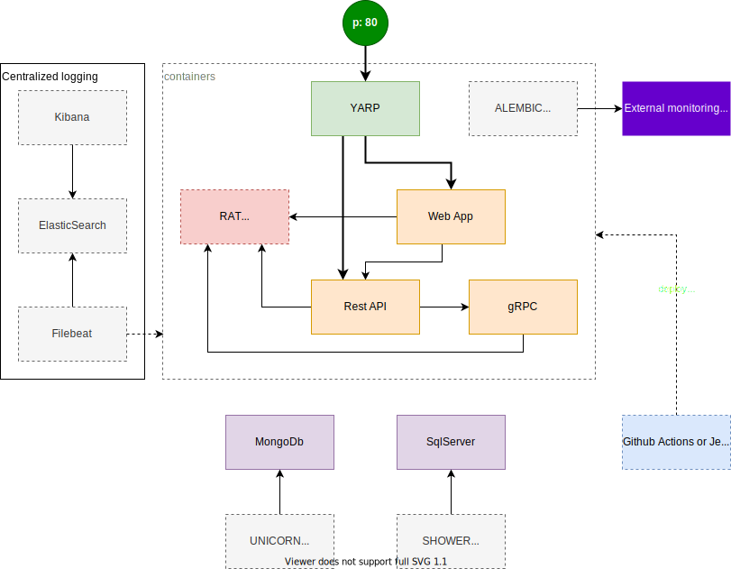

# :lollipop: Lollipop
The :lollipop: is a try on building a simplest possible microservice architecture

# Motiviation

There are a lots of solution for building microservices the first that will pop up is Kuberetes of course, then there you have Docker Swarm, or HashiCorp's stack and I am not going to mention the cloud, but if you have a simple system, or a smaller one you will probably try to go with docker-compose and then you will see that there are things missing.  
Things that you are not planning to code yourself and that is a probably a good idea, unless you are really experience in matters like API Gateways, load balancers etc...  

The idea behind the :lollipop: is to start with docker-compose and find the least amount of 3rd party tools (that are well known) or build utilities that are simple but missing.  
The end product should enable anyone to quick design and build a microservice architecture while maintaining small infrastructure footprint.

# Diagram

# Requirements

The system must provide:
* Load balancing
* Ingress/Egress
* Circuit breaking
* Ability to do canary deployment
* Monitoring
* Centralized logging
* Tracing

Current 3rd party tools:
* [YARP](https://github.com/microsoft/reverse-proxy): will be used for ingress/egress, load balancing, circuit breaking and way to do canary deployments
* Centralized logging: ELK stack most probably
* Tracing: OpenTracing or OpenTelemetry if it is ready
* Monitoring: Using [:alembic:](https://github.com/MirzaMerdovic/alembic) or going all the way with Prometheus will see 
* Configuration management using [:rat:](https://github.com/MirzaMerdovic/rat). _Note: optional component_

Local development utilities:
* Seeders: [:unicorn:](https://github.com/MirzaMerdovic/unicorn) and [:shower:](https://github.com/MirzaMerdovic/shower)

CI:
* [docker-semver](https://github.com/MirzaMerdovic/docker-semver-github-action) - GitHub Action for building SemVer tagged Docker images.
